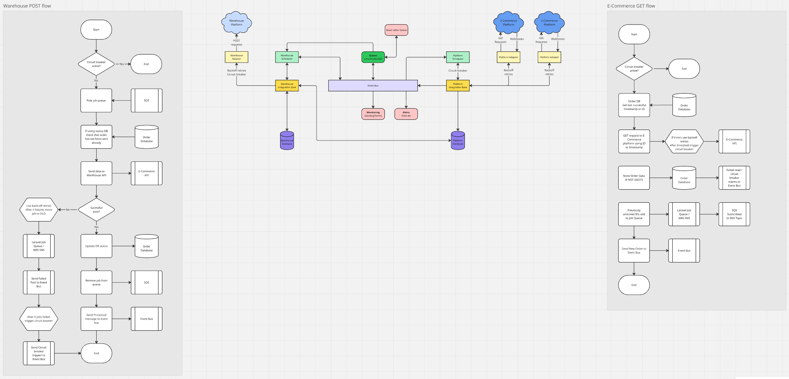

# High Cohesion Programming Questions


### The programming questions are covered by the following files:

#### 1. Write a class/classes in PHP to represent the above ORDER.
- Covered by `Entities/OrderEntity.php`
- The base `Entities/Entity` class provides methods for getting and setting the data in a variety of ways
  - Json
  - Array
  - Individual properties
- The base class end child extensions provide type hinting/safety on the individual properties and also 
- allow for default values to be set


#### 2. Create a function to parse a json file into a PHP ORDER object.
- Covered by `Services/ParseOrderService.php`
- This class converts the Shipping Address and Line Items to entities/collections and builds an 
  OrderEntity class, instantiated as follows:
```
$orderEntityClass = (new ParseOrderService)->parseJsonOrder($orderJsonData);
```


#### 4. If all the entities from the e-commerce system need a method to return the title field (**getTitle**). 
Which PHP data structure would you use to make sure this method is required on every new class that we add in our script?
- Covered by `Interfaces/CartInterface.php`
- Creating an interface that defines all the required methods and implementing that interface by the appropriate classes 
(e.g. `Entities/LineItem.php`) ensures that the classes implement the required methods


#### 5. Create a new class to store a list of ORDERs. Implement a public method to return the list.
- Covered by `Entities/Collections/Orders.php`
- Stores a list of OrderEntities and provides methods to retrieve them


### Question 3:  
Imagine that you also need to create a class for PURCHASE_ORDER and it contains the 
same title, currency and total fields as ORDER, how would you optimise both classes?

- Any duplicated fields could have their own entity class created, which could then by 
  type-hinted on both the order and Purchase Order classes.

- In a database, these duplicated fields would be normalised into their own table and 
  foreign key fields used in order and purchase_order tables to reference them by id.
  This also allows constraints to be set up so that the duplicated data fields couldn't   
  be deleted if they are being reference, thereby ensuring data integrity

---

## Brainstorming an integration plan

The following diagram shows some ideas I had whilst thinking about this integration. It includes:

- Base/Adaptor layers for the E-Commerce and Warehouse integrations - Base layer to contain reusable systems
- Schedulers to control getting/posting of data with back-off retry plans and circuit breakers
- Queueing of jobs with Dead Letter Queue for simplified retry of failed jobs
- Event bus to centralise systems, logging, alerting etc. and allow simplified integration of new systems


